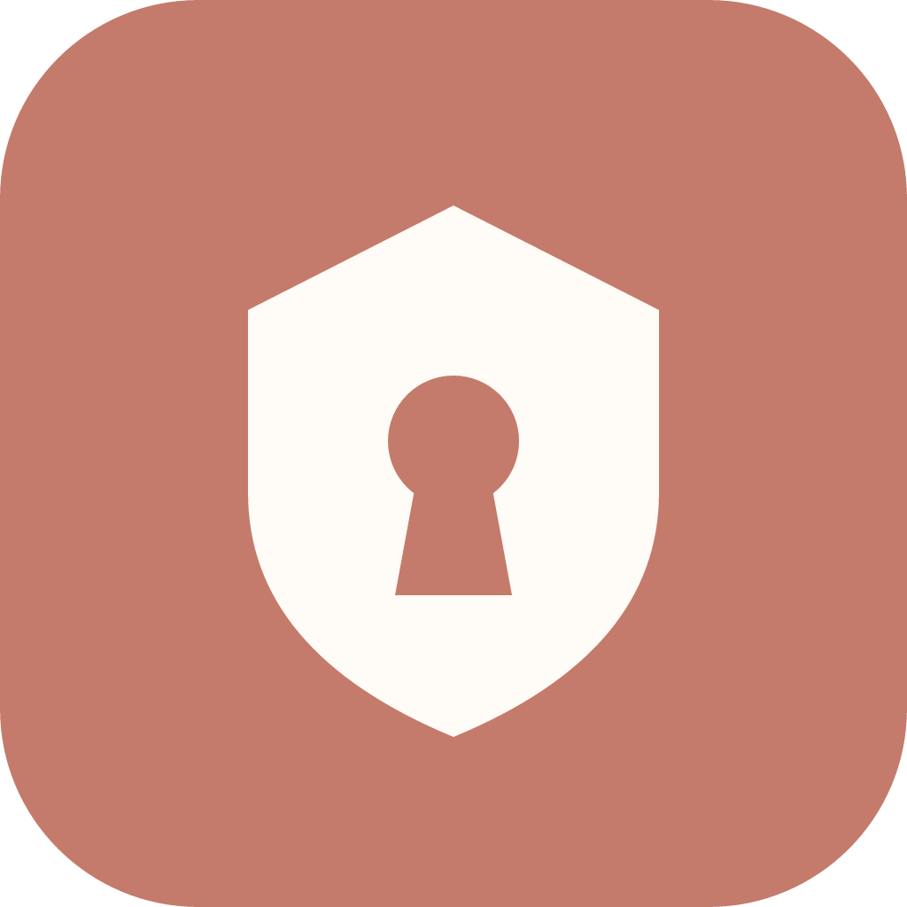

<div align="center">



# FreePass

**Votre coffre de mots de passe, 100 % local. Sans cloud, sans compte, sans abonnement.**

Vos identifiants sont chiffrés sur **votre** machine. Un seul mot de passe maître les
déverrouille. Une extension navigateur les pré-remplit. Rien ne part sur Internet.

</div>

---

## Pourquoi FreePass ?

La plupart des gestionnaires de mots de passe stockent votre coffre sur **leurs**
serveurs et vous facturent un abonnement. FreePass fait l'inverse :

- 🔒 **Tout reste chez vous.** Le coffre est un fichier chiffré sur votre disque. Aucun
  serveur, aucun compte, aucune télémétrie.
- 🗝️ **Un seul mot de passe à retenir.** Votre mot de passe maître dérive (Argon2id) la
  clé qui déchiffre vos secrets — uniquement en mémoire, jamais écrite sur le disque.
- 🧩 **Remplissage automatique** dans Chrome et Firefox, via un canal **local** sécurisé.
- 🎲 **Générateur** de mots de passe forts intégré.
- 📥 **Import** depuis Chrome, Firefox, Bitwarden… (export CSV).
- 🔄 **Mises à jour automatiques** : la nouvelle version vous est proposée dans l'app.
- ⚡ **Léger et rapide** : application native (Tauri), un seul exécutable.

> ### ⚠️ Important : aucune récupération
> FreePass ne peut **pas** réinitialiser votre mot de passe maître. Si vous l'oubliez,
> le coffre est **définitivement perdu** — c'est le prix de la confidentialité totale.
> **Sauvegardez régulièrement votre fichier coffre** et choisissez un mot de passe
> maître solide que vous n'oublierez pas.

---

## Installation

### Windows

1. Rendez-vous sur la page **[Releases](https://github.com/OlivierBesnard/FreePass/releases)**.
2. Téléchargez le dernier installeur (`FreePass_x.y.z_x64-setup.exe` ou `.msi`).
3. Lancez-le. C'est tout — pas de compte à créer.

*(macOS et Linux à venir.)*

### Depuis les sources (développeurs)

```bash
pnpm install
pnpm tauri dev      # lancer en développement
pnpm tauri build    # produire l'installeur
```
Pré-requis : Rust, Node + pnpm, et le bundler de votre OS.

---

## Comment ça marche

1. **Créez votre coffre.** Au premier lancement, choisissez un mot de passe maître.
   FreePass génère vos clés de chiffrement et crée le coffre, verrouillé.
2. **Déverrouillez.** À chaque ouverture, saisissez le mot de passe maître : vos
   secrets sont déchiffrés **en mémoire** pour la session.
3. **Gérez vos identifiants.** Ajoutez, modifiez, recherchez (`Ctrl/Cmd + K`), générez
   des mots de passe, importez un CSV.
4. **Remplissez vos sites** grâce à l'extension (voir ci-dessous).
5. **Verrouillez** manuellement, ou laissez le verrouillage automatique agir après
   inactivité — vos clés sont alors effacées de la mémoire.

---

## L'extension navigateur

L'extension pré-remplit vos identifiants en parlant à l'application **uniquement en
local** (`127.0.0.1`), jamais via Internet.

**Installer (Chrome / Edge)** : `chrome://extensions` → mode développeur → *Charger
l'extension non empaquetée* → dossier `extension/`.
**Installer (Firefox)** : `about:debugging` → *Charger un module temporaire* →
`extension/manifest.json`.

**Appairer** : ouvrez FreePass, déverrouillez le coffre, cliquez sur l'icône 🧩
« Connecter l'extension » et copiez le **port** + le **token** dans le popup de
l'extension. Sur un site, le popup liste les identifiants correspondants → **Remplir**.

Détails : [`extension/README.md`](extension/README.md).

---

## Sécurité en bref

- **Chiffrement au repos** : chaque secret est chiffré (XChaCha20-Poly1305) avec une clé
  qui n'existe qu'en mémoire après déverrouillage.
- **Dérivation forte** : mot de passe maître → Argon2id (coût mémoire élevé) → clés.
- **Rien en clair** : ni le mot de passe maître, ni les clés ne sont écrits sur le disque
  ou dans un journal.
- **Anti-hameçonnage** : le remplissage ne propose que les identifiants du **bon domaine**,
  et jamais sans votre clic.
- **Canal local only** : l'extension communique sur `127.0.0.1` avec un jeton d'appairage ;
  aucun secret ne quitte la machine.
- **Mises à jour signées** : seules les mises à jour signées par l'éditeur sont acceptées.

Le détail vit dans [`CRYPTO_SPEC.md`](CRYPTO_SPEC.md) et [`THREAT_MODEL.md`](THREAT_MODEL.md).

---

## Mises à jour

FreePass vérifie au démarrage s'il existe une version plus récente et vous propose de
l'installer **dans l'application** — vous n'avez jamais à revenir sur GitHub.

---

## Pour les développeurs

- [`DESIGN.md`](DESIGN.md) — modèle fonctionnel et de sécurité.
- [`CRYPTO_SPEC.md`](CRYPTO_SPEC.md) — contrat cryptographique v1.
- [`THREAT_MODEL.md`](THREAT_MODEL.md) — menaces et mitigations (F1–F20).
- [`SECURITY.md`](SECURITY.md) — état des mitigations.
- [`PLAN.md`](PLAN.md) — feuille de route par phases.
- [`RELEASING.md`](RELEASING.md) — publier une version.
- [`CLAUDE.md`](CLAUDE.md) — conventions du dépôt.

Stack : **Tauri 2** (Rust + SQLite) · **React 19** + TypeScript + Tailwind · crypto
**RustCrypto** (Argon2id, XChaCha20-Poly1305).
